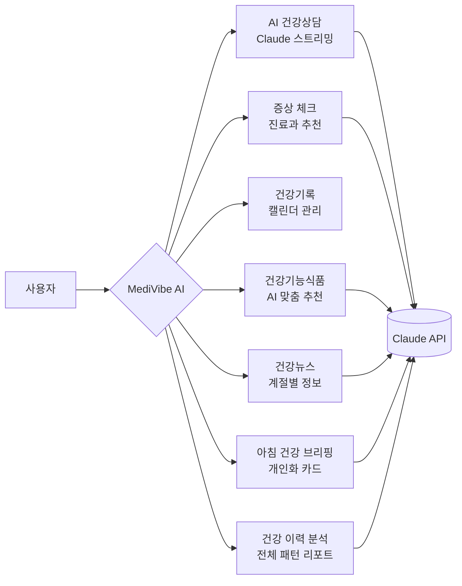

# MediVibe AI — 해커톤 제출용 PRD

> **유비케어 IT개발본부 해커톤** | 2026-03-13 | Claude API 기반 AI 의료 정보 어시스턴트

---

## Project Overview

MediVibe AI는 **Anthropic Claude API**를 핵심 엔진으로 사용하는 AI 의료 정보 플랫폼이다. 일반인이 의료 용어를 이해하고 건강 정보를 탐색하는 과정에서 겪는 정보 접근성 문제를 해결하기 위해, AI 건강상담 챗봇·증상 체크·건강기록·건강기능식품 추천·건강뉴스·**아침 건강 브리핑·건강 이력 분석** 7개 기능을 하나의 웹앱에 통합했다. Next.js 16 + TypeScript + Tailwind CSS 기반으로 개발되었으며 Vercel에 배포된다.

---

## Problem

| # | 문제 | 현실 |
|---|---|---|
| 1 | 의료 용어 장벽 | 처방전·검사결과의 전문 용어를 환자가 이해하기 어려움 |
| 2 | 정보 과부하 | 검색 결과가 방대하고 신뢰도 판별 불가 |
| 3 | 단절된 건강 기록 | 상담 내용이 분산되어 연속적인 건강 관리 불가 |
| 4 | 맥락 없는 영양제 추천 | 쇼핑몰 리뷰 기반 추천으로 개인 상황 미반영 |

---

## Solution



모든 AI 기능은 **서버 사이드 API Route**에서 Claude를 호출하여 API 키를 보호하고, 클라이언트 캐시(`useRef`)로 중복 호출을 제거해 응답 속도를 최적화했다.

---

## AI Architecture

### Claude API 활용 지점

| 기능 | 엔드포인트 | 모델 | 응답 방식 | 역할 |
|---|---|---|---|---|
| AI 건강상담 | `/api/chat` | claude-haiku-4-5 | **Streaming** | 의료 용어 설명, 건강 Q&A, 멀티턴 대화 |
| 증상 체크 | `/api/symptom` | claude-haiku-4-5 | JSON | 증상 분석 → 추정 진료과·주의사항 반환 |
| 건강기능식품 | `/api/supplements` | claude-haiku-4-5 | JSON | 카테고리·정렬 기준별 제품 10개 추천 |
| 건강뉴스 | `/api/health-news` | claude-haiku-4-5 | JSON | 현재 월·계절 기반 건강 기사 8건 생성 |
| **아침 건강 브리핑** | `/api/morning-briefing` | claude-haiku-4-5 | JSON | 최근 3일 상담 + 계절 기반 개인화 브리핑 생성 (일 1회 캐시) |
| **건강 이력 분석** | `/api/weekly-insight` | claude-haiku-4-5 | JSON | 전체 이력(최대 3년) 패턴 분석 — 키워드·진료과·긴급도·월평균·추천 (월 1회 캐시) |

### System Prompt 설계 전략

```
건강상담  → 역할 정의 + 면책 고지 내재화 + 한국어 응답 강제
증상체크  → JSON Schema 출력 강제 (진료과, 긴급도, 예방팁)
건강뉴스  → 계절 파라미터 주입 → 시의성 있는 콘텐츠 생성
건기식    → 정렬 기준(인기/가격) + 식약처 기준 명시 → 신뢰도 확보
```

### 성능 최적화

- **클라이언트 캐시**: `useRef<Record<string, Data>>` — 동일 요청 재호출 방지
- **DataSplash UX**: 로딩 중 단계별 진행 메시지로 체감 속도 개선
- **스트리밍**: 건강상담은 첫 토큰 즉시 표시로 대기감 제거
- **localStorage 장기 캐시**: 브리핑(일 1회), 인사이트(월 1회) — API 호출 최소화
- **경량 세션 요약 전송**: 전체 대화 대신 `SessionSummary`(제목·진료과·긴급도)만 전송 — 토큰 절약

---

## Implementation Plan

| 단계 | 작업 | 상태 |
|---|---|---|
| **S1** | Next.js 프로젝트 셋업 + Claude API 스트리밍 채팅 | ✅ 완료 |
| **S2** | 증상 체크 기능 (JSON 응답 + 진료과 추천 UI) | ✅ 완료 |
| **S3** | 건강기록 캘린더 (로컬 세션 저장 + 날짜별 조회) | ✅ 완료 |
| **S4** | 건강기능식품 추천 (카테고리·정렬·캐시·더보기) | ✅ 완료 |
| **S5** | 건강뉴스 (계절 기반 AI 기사 생성 + 캐시) | ✅ 완료 |
| **S6** | DataSplash 로딩 UX + 챗봇 캐릭터 이미지 | ✅ 완료 |
| **S7** | 메뉴 패널 4탭 (기능안내·업데이트·앱정보·불만접수) | ✅ 완료 |
| **S8** | 반응형 그리드 (md:2열, xl:3열) + 캘린더 고정 레이아웃 | ✅ 완료 |
| **S9** | 아침 건강 브리핑 — 채팅 빈 상태 개인화 카드 (일별 캐시, 새로고침) | ✅ 완료 |
| **S10** | 건강 이력 분석 탭 — 전체 이력 AI 분석 리포트 (월별 캐시, 5개 섹션) | ✅ 완료 |
| **Deploy** | Vercel 배포 + ANTHROPIC_API_KEY 환경 변수 설정 | 🔄 진행 중 |

---

## Demo Scenario

> **심사위원 앞에서 보여줄 2분 시나리오**

```
1. [홈] 사이드바 구성 설명 (5개 탭 + Your Health Intelligence 태그라인)

2. [AI 건강상담 — 빈 화면] 아침 건강 브리핑 카드 확인
   → 최근 상담 요약 + 계절 팁 + 오늘의 건강 체크 항목 표시
   → 새로고침(↺) 버튼으로 재생성 동작 확인

3. [AI 건강상담] "당뇨 전단계라고 들었는데 식단 어떻게 해야 하나요?"
   → 스트리밍으로 실시간 답변 타이핑 확인

4. [증상 체크] "두통이 3일째 지속되고 눈이 침침해요" 입력
   → 추정 진료과(신경과/안과) + 주의 증상 카드 표시

5. [건강기능식품] 면역력 카테고리 → 인기순 클릭
   → DataSplash 로딩 → 10개 제품 그리드 (3열) → 더보기 동작 확인

6. [건강뉴스] 3월 건강 정보 로드
   → 봄 계절 기반 AI 생성 기사 8건 확인 (미세먼지, 꽃가루 등)

7. [건강 이력 분석] 리포트 탭 클릭
   → DataSplash "전체 상담 이력 분석 중" → 인사이트 리포트 표시
   → 반복 키워드 바 차트 + 진료과 분포 + 월평균 통계 확인

8. [건강기록] 캘린더에서 날짜 선택 → 상담 건수/추천과 표시
   → 우측 검색창으로 이전 상담 내용 검색
```

---

## Expected Impact

### 개발 생산성

| 지표 | Before | After |
|---|---|---|
| 기능 구현 속도 | 수작업 UI + 로직 분리 개발 | Claude Code로 컴포넌트 생성 5× 가속 |
| API 연동 시간 | 문서 탐색 + 코드 작성 1~2시간 | Skill 파일 기반 즉시 구현 |
| 반복 디버깅 | 오류 재현 → 수동 수정 | Claude가 컨텍스트 유지하며 순차 해결 |

### AI-Native 개발 환경 전환

- **CLAUDE.md** — 프로젝트 컨텍스트 영구 문서화로 세션 간 맥락 유지
- **`.claude/agents/`** — Sprint Planner 에이전트로 작업 자동 분해
- **`.claude/skills/`** — Frontend Design 스킬로 UI 패턴 재사용
- **결과:** 단일 해커톤 세션(1일)에서 5개 AI 기능 탑재 웹앱 완성

---

*MediVibe AI · Next.js 16 · Anthropic Claude API · Vercel · 2026*
